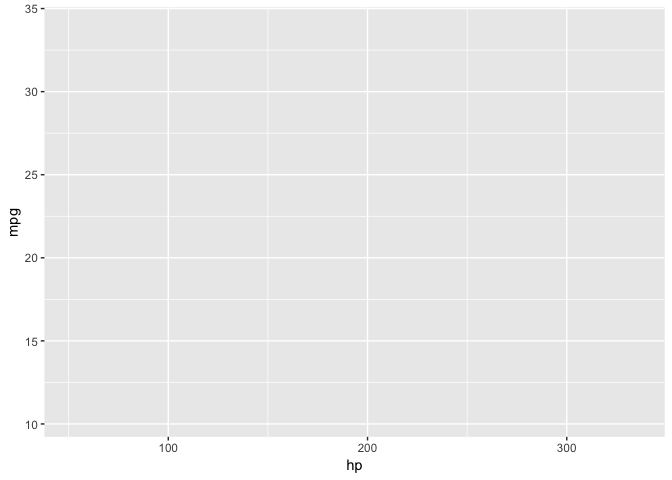
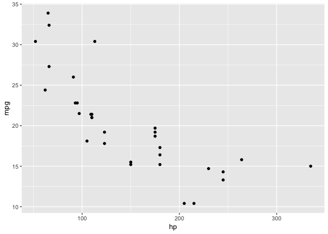
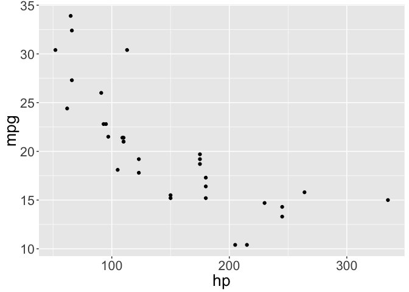
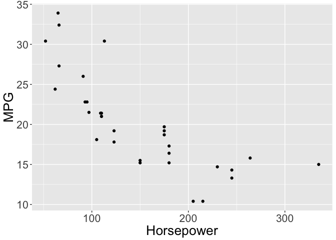
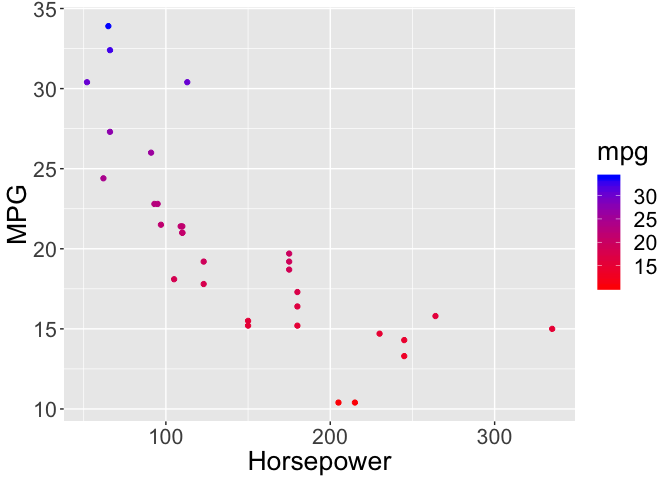
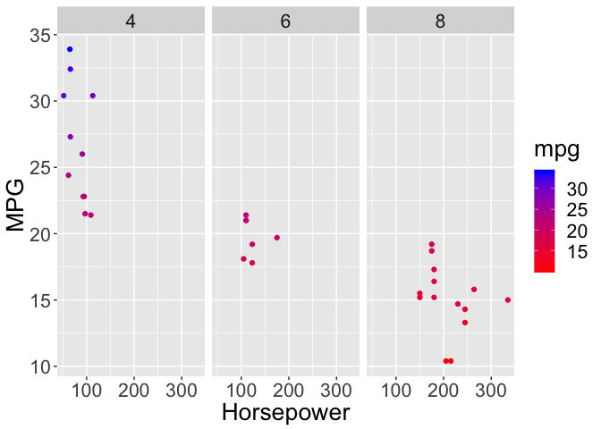
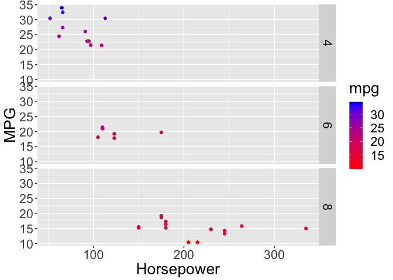

R Workshop for Education Data Science Lesson 1
================
Fernando Rodriguez
1/10/2019

<br>

Table of Contents
-----------------

1.  Loading Libraries
2.  Creating and running code-chunks in R-Markdown
3.  The basics
    -   Simple calculations
    -   Assignment
4.  Exploring Data
    -   head()
5.  Graphic Data
    -   plot()
6.  A Note on Arguments
7.  Intro to ggplot2 library and functions
    -   aes()
    -   geom()
    -   theme()
    -   labs()
    -   scale\_color\_gradient()
    -   facet\_grid()
8.  Learning More About Libraries and Functions

1. Loading Libraries
--------------------

First, let's load the libraries you will use for this lesson. This is the first thing you should do when writing an R-Markdown document. That way, you ensure that you load all of the necessary libraries prior to running code

``` r
# install.libraries("gglot2") <- installing libraries require double qoutations ""
library(ggplot2) # <- loading libraries doesn't require double qoutations
```

<br><br>

Before going into the ins-and-outs of coding in R, let's get familiar with how we can use R-markdown to create chunks of code.<br>

2. Creating code chunks in R-Markdown
-------------------------------------

alt + command + i (mac)<br> control + alt + i (windows)<br>

Each chunk of code can be run individually.

``` r
3 + 3
```

    ## [1] 6

### Running chunnks

You can run the chunk of code by clicking on the green arrow to the right of the code.

Or use theses shortcuts<br)
command + enter (mac)<br> control + enter (windows) <br><br> \#\# 3. The very basics \#\#\# Simple Caluations

``` r
2 + 2
```

    ## [1] 4

``` r
10/2
```

    ## [1] 5

### Assignment

We assign values to variables by using `<-`<br> Assigning a, b, and c

``` r
a <- 2 + 2
b <- 10 + 2
c <- 4 + 12
```

Creating d, which is a + b
--------------------------

``` r
d <- a + b
d
```

    ## [1] 16

<br><br>

4. Exploring Data<br>
---------------------

### `mtcars` data

This data is pre-installed in R, and provides a quick way to fiddle around with coding.

We can see the data by simply typing `mtcars`

``` r
mtcars
```

    ##                      mpg cyl  disp  hp drat    wt  qsec vs am gear carb
    ## Mazda RX4           21.0   6 160.0 110 3.90 2.620 16.46  0  1    4    4
    ## Mazda RX4 Wag       21.0   6 160.0 110 3.90 2.875 17.02  0  1    4    4
    ## Datsun 710          22.8   4 108.0  93 3.85 2.320 18.61  1  1    4    1
    ## Hornet 4 Drive      21.4   6 258.0 110 3.08 3.215 19.44  1  0    3    1
    ## Hornet Sportabout   18.7   8 360.0 175 3.15 3.440 17.02  0  0    3    2
    ## Valiant             18.1   6 225.0 105 2.76 3.460 20.22  1  0    3    1
    ## Duster 360          14.3   8 360.0 245 3.21 3.570 15.84  0  0    3    4
    ## Merc 240D           24.4   4 146.7  62 3.69 3.190 20.00  1  0    4    2
    ## Merc 230            22.8   4 140.8  95 3.92 3.150 22.90  1  0    4    2
    ## Merc 280            19.2   6 167.6 123 3.92 3.440 18.30  1  0    4    4
    ## Merc 280C           17.8   6 167.6 123 3.92 3.440 18.90  1  0    4    4
    ## Merc 450SE          16.4   8 275.8 180 3.07 4.070 17.40  0  0    3    3
    ## Merc 450SL          17.3   8 275.8 180 3.07 3.730 17.60  0  0    3    3
    ## Merc 450SLC         15.2   8 275.8 180 3.07 3.780 18.00  0  0    3    3
    ## Cadillac Fleetwood  10.4   8 472.0 205 2.93 5.250 17.98  0  0    3    4
    ## Lincoln Continental 10.4   8 460.0 215 3.00 5.424 17.82  0  0    3    4
    ## Chrysler Imperial   14.7   8 440.0 230 3.23 5.345 17.42  0  0    3    4
    ## Fiat 128            32.4   4  78.7  66 4.08 2.200 19.47  1  1    4    1
    ## Honda Civic         30.4   4  75.7  52 4.93 1.615 18.52  1  1    4    2
    ## Toyota Corolla      33.9   4  71.1  65 4.22 1.835 19.90  1  1    4    1
    ## Toyota Corona       21.5   4 120.1  97 3.70 2.465 20.01  1  0    3    1
    ## Dodge Challenger    15.5   8 318.0 150 2.76 3.520 16.87  0  0    3    2
    ## AMC Javelin         15.2   8 304.0 150 3.15 3.435 17.30  0  0    3    2
    ## Camaro Z28          13.3   8 350.0 245 3.73 3.840 15.41  0  0    3    4
    ## Pontiac Firebird    19.2   8 400.0 175 3.08 3.845 17.05  0  0    3    2
    ## Fiat X1-9           27.3   4  79.0  66 4.08 1.935 18.90  1  1    4    1
    ## Porsche 914-2       26.0   4 120.3  91 4.43 2.140 16.70  0  1    5    2
    ## Lotus Europa        30.4   4  95.1 113 3.77 1.513 16.90  1  1    5    2
    ## Ford Pantera L      15.8   8 351.0 264 4.22 3.170 14.50  0  1    5    4
    ## Ferrari Dino        19.7   6 145.0 175 3.62 2.770 15.50  0  1    5    6
    ## Maserati Bora       15.0   8 301.0 335 3.54 3.570 14.60  0  1    5    8
    ## Volvo 142E          21.4   4 121.0 109 4.11 2.780 18.60  1  1    4    2

If you want to see less rows you can use the function `head`

``` r
head(mtcars)
```

    ##                    mpg cyl disp  hp drat    wt  qsec vs am gear carb
    ## Mazda RX4         21.0   6  160 110 3.90 2.620 16.46  0  1    4    4
    ## Mazda RX4 Wag     21.0   6  160 110 3.90 2.875 17.02  0  1    4    4
    ## Datsun 710        22.8   4  108  93 3.85 2.320 18.61  1  1    4    1
    ## Hornet 4 Drive    21.4   6  258 110 3.08 3.215 19.44  1  0    3    1
    ## Hornet Sportabout 18.7   8  360 175 3.15 3.440 17.02  0  0    3    2
    ## Valiant           18.1   6  225 105 2.76 3.460 20.22  1  0    3    1

### `pressure` data

We can see that there are only two variables in the pressure data

``` r
head(pressure)
```

    ##   temperature pressure
    ## 1           0   0.0002
    ## 2          20   0.0012
    ## 3          40   0.0060
    ## 4          60   0.0300
    ## 5          80   0.0900
    ## 6         100   0.2700

<br><br>

5. Graphing Data
----------------

We can use the `plot` function to create a scatter plot for the `pressure` data

``` r
plot(pressure)
```

 <br><br>

6. A Note on Arguments
----------------------

Notice that functions in R always have () beside them<br> head(mtcars)<br> plot(pressure)<br> <br> In R, we put our arguments (which are extra things we want the argument to do) inside these parentheses.

<br><br> \#\# 7. Intro to ggplot library and functions Remember to make sure ggplot is loaded into R.<br> You can do this by running the first chunk of this document, where it has the code `library(ggplot2)`<br> <br> We want to plot how miles per galon `mpg` is related to horsepower `hp`. And then we want to split this up by cylnders `cyl`.<br><br>

for ggplot, our first argument will be the dataset `mtcars`

``` r
ggplot(mtcars)
```

 <br><br>

#### aes() function for stating your x and y axis

Within the ggplot() function, we'll set up our parameters by using the `aes()` function aes stands for asthetic. For this function, we want to define the x and y axis.

The x-axis will be `hp` and the y-axis will be `mpg`

``` r
ggplot(mtcars, aes(x = hp, y = mpg))
```

 <br><br>

### The power of `+`

### Adding features to your ggplot graph using `+`

We can add new features by using other functions that are part of the ggplot library.

We do this by using the `+` sign

<br><br> \#\#\#\# geom() function for stating the kind of graph you want

geom stands for geometric unit.<br>

Now let's use the `geom` family of functions to state what kind of graph we want.<br>

We want a scatterplot, so we are going to use the function `geom_point()`<br>

No arguments are required for `geom_point()`

``` r
ggplot(mtcars, aes(x = hp, y = mpg)) + 
 geom_point() 
```

 <br><br>

#### theme() function for modifying components of your graph

let's set the size of the text by 20 using `text = element_text(size = 20)`

``` r
ggplot(mtcars, aes(x = hp, y = mpg)) + 
  geom_point() + 
  theme(text = element_text(size = 20))
```

 <br><br>

#### labs() function for labeling your graph

``` r
ggplot(mtcars, aes(x = hp, y = mpg)) + 
 geom_point() + 
  theme(text = element_text(size = 20)) +
  labs(x = "Horsepower", y = "MPG")
```

 <br><br>

#### scale\_color\_gradient() function for using a color gradient on mpg

We want the low mpg to be blue and the high mpg to be red.<br>

IMPORTANT! In order to make this function work, you have to state which variable you want it to color. Let's color `mpg`. <br>

In order to state this, we have to go back to the `aes()` function and write an additional argument. Remember, arguments are separated by `,`<br>

So your aes code should look like this now `aes(x = hp, y = mpg, color = mpg)`

``` r
ggplot(mtcars, aes(x = hp, y = mpg, color = mpg)) + 
 geom_point() + 
  theme(text = element_text(size = 20)) +
  labs(x = "Horsepower", y = "MPG") +
  scale_color_gradient(low = "red", high = "blue")
```

 <br><br>

#### facet\_grid() function splitting up the graph by a group

We want to split our graph up by the variable `cyl`<br>

use `.~cyl` to get a horizontal verison

``` r
ggplot(mtcars, aes(x = hp, y = mpg, color = mpg)) + 
 geom_point() + 
  theme(text = element_text(size = 20)) +
  labs(x = "Horsepower", y = "MPG") +
  scale_color_gradient(low = "red", high = "blue") +
  facet_grid(.~cyl)
```

 <br><br>

use `cyl~.` to get a vertical verison.

``` r
ggplot(mtcars, aes(x = hp, y = mpg, color = mpg)) + 
 geom_point() + 
  theme(text = element_text(size = 20)) +
  labs(x = "Horsepower", y = "MPG") +
  scale_color_gradient(low = "red", high = "blue") +
  facet_grid(cyl~.)
```

 <br><br>

### 8. Learning More About Libraries and Functions

If you want to see more information about what you can do with a library like ggplot2, you can put `?` in front of the name of the library.

``` r
?ggplot2
```

<br><br> If you want to know more about how to use a specific function put a ? in front of the function name

``` r
?ggplot()
```

<br><br> You can even do this with sub-functions, like `element_text()`

``` r
?element_text()
```
