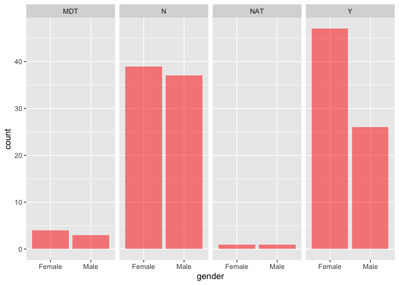

Lesson 3
================
Fernando Rodriguez
1/24/2019

# 0\. Load Libraries

``` r
library(ggplot2) # for graphing
library(summarytools) # for getting data summaries
library(readr) # for reading in data
```

# 1\. Import demographic data using read.csv()

``` r
demog <- read.csv("/Volumes/GoogleDrive/My Drive/R Workspace/R-for-Ed-Data-Science/Data/Physics Course Demo Data.csv", header = TRUE)
```

run
    dfSummary()

``` r
print(dfSummary(demog), method = 'browser')
```

    ## Output file written: /var/folders/vv/4z329kws7cz22bxhrvzc0mjh0000gp/T//RtmpY2VxFT/file182264cf2386.html

We need to use the na.strings argument to get correct NAs

na.string replaces values in your csv file with
NAs

``` r
demog <- read.csv("/Volumes/GoogleDrive/My Drive/R Workspace/R-for-Ed-Data-Science/Data/Physics Course Demo Data.csv", header = TRUE, na.strings = "")
```

``` r
print(dfSummary(demog), method = 'browser')
```

    ## Output file written: /var/folders/vv/4z329kws7cz22bxhrvzc0mjh0000gp/T//RtmpY2VxFT/file18226fcb8787.html

# importing demographic data using read\_csv()

``` r
demog2 <- read_csv("/Volumes/GoogleDrive/My Drive/R Workspace/R-for-Ed-Data-Science/Data/Physics Course Demo Data.csv")
```

    ## Parsed with column specification:
    ## cols(
    ##   roster_randomid = col_double(),
    ##   officialroster = col_character(),
    ##   ingradebookdata = col_character(),
    ##   insurveyparticipatedata = col_character(),
    ##   status = col_character(),
    ##   gender = col_character(),
    ##   eth2009rollupforreporting = col_character(),
    ##   agegroup = col_character(),
    ##   lowincomeflag = col_character(),
    ##   fulltimestatus = col_character(),
    ##   firstgenerationflag = col_character(),
    ##   homeprimarylang = col_character(),
    ##   admissionsstatusdetail = col_character(),
    ##   hsgpa = col_double(),
    ##   transfergpa = col_double(),
    ##   gpacumulative = col_logical(),
    ##   firstregacadyr = col_character(),
    ##   firstregacadterm = col_character(),
    ##   major1 = col_character()
    ## )

``` r
# View(demog2)
```

compare demog and demog2

``` r
str(demog)
```

    ## 'data.frame':    192 obs. of  19 variables:
    ##  $ roster_randomid          : int  672849 872962 482931 455346 491579 608378 714417 508735 407162 529371 ...
    ##  $ officialroster           : Factor w/ 2 levels "NO","Yes": 2 2 2 2 2 2 2 2 2 2 ...
    ##  $ ingradebookdata          : Factor w/ 1 level "Yes": 1 1 1 1 1 1 1 1 1 1 ...
    ##  $ insurveyparticipatedata  : Factor w/ 1 level "Yes": 1 1 1 1 1 1 1 1 1 1 ...
    ##  $ status                   : Factor w/ 1 level "Enrolled": 1 1 1 1 1 1 1 1 1 1 ...
    ##  $ gender                   : Factor w/ 3 levels "Female","Male",..: 2 2 2 2 1 1 2 1 2 2 ...
    ##  $ eth2009rollupforreporting: Factor w/ 5 levels "Asian / Pacific Islander",..: 3 1 5 1 1 2 1 1 4 1 ...
    ##  $ agegroup                 : Factor w/ 8 levels "18","19","20",..: 3 3 7 2 3 2 3 2 3 2 ...
    ##  $ lowincomeflag            : Factor w/ 3 levels "N","NAT","Y": 1 1 1 1 3 1 1 1 1 3 ...
    ##  $ fulltimestatus           : Factor w/ 2 levels "Full-time","Part-time": 2 2 2 1 1 1 1 2 1 2 ...
    ##  $ firstgenerationflag      : Factor w/ 4 levels "MDT","N","NAT",..: 2 2 4 4 4 4 2 4 4 4 ...
    ##  $ homeprimarylang          : Factor w/ 4 levels "English only",..: 2 1 4 1 4 1 2 1 4 2 ...
    ##  $ admissionsstatusdetail   : Factor w/ 3 levels "Freshman","Not applicable",..: 1 1 3 1 1 1 1 1 1 1 ...
    ##  $ hsgpa                    : num  4.18 4 NA 4.04 4.14 ...
    ##  $ transfergpa              : num  NA NA 3.22 NA NA NA NA NA NA NA ...
    ##  $ gpacumulative            : logi  NA NA NA NA NA NA ...
    ##  $ firstregacadyr           : Factor w/ 5 levels "2009-10","2012-13",..: 4 3 5 5 4 4 4 4 4 4 ...
    ##  $ firstregacadterm         : Factor w/ 1 level "Fall": 1 1 1 1 1 1 1 1 1 1 ...
    ##  $ major1                   : Factor w/ 26 levels "Anthropology",..: 4 4 18 12 4 20 4 4 4 4 ...

``` r
str(demog2)
```

    ## Classes 'spec_tbl_df', 'tbl_df', 'tbl' and 'data.frame': 192 obs. of  19 variables:
    ##  $ roster_randomid          : num  672849 872962 482931 455346 491579 ...
    ##  $ officialroster           : chr  "Yes" "Yes" "Yes" "Yes" ...
    ##  $ ingradebookdata          : chr  "Yes" "Yes" "Yes" "Yes" ...
    ##  $ insurveyparticipatedata  : chr  "Yes" "Yes" "Yes" "Yes" ...
    ##  $ status                   : chr  "Enrolled" "Enrolled" "Enrolled" "Enrolled" ...
    ##  $ gender                   : chr  "Male" "Male" "Male" "Male" ...
    ##  $ eth2009rollupforreporting: chr  "International student" "Asian / Pacific Islander" "White, non-Hispanic" "Asian / Pacific Islander" ...
    ##  $ agegroup                 : chr  "20" "20" "24" "19" ...
    ##  $ lowincomeflag            : chr  "N" "N" "N" "N" ...
    ##  $ fulltimestatus           : chr  "Part-time" "Part-time" "Part-time" "Full-time" ...
    ##  $ firstgenerationflag      : chr  "N" "N" "Y" "Y" ...
    ##  $ homeprimarylang          : chr  "English/non-English" "English only" "Non-English" "English only" ...
    ##  $ admissionsstatusdetail   : chr  "Freshman" "Freshman" "Transfer" "Freshman" ...
    ##  $ hsgpa                    : num  4.18 4 NA 4.04 4.14 ...
    ##  $ transfergpa              : num  NA NA 3.22 NA NA NA NA NA NA NA ...
    ##  $ gpacumulative            : logi  NA NA NA NA NA NA ...
    ##  $ firstregacadyr           : chr  "2014-15" "2013-14" "2015-16" "2015-16" ...
    ##  $ firstregacadterm         : chr  "Fall" "Fall" "Fall" "Fall" ...
    ##  $ major1                   : chr  "Biological Sciences" "Biological Sciences" "Psychology" "Education Sciences" ...
    ##  - attr(*, "spec")=
    ##   .. cols(
    ##   ..   roster_randomid = col_double(),
    ##   ..   officialroster = col_character(),
    ##   ..   ingradebookdata = col_character(),
    ##   ..   insurveyparticipatedata = col_character(),
    ##   ..   status = col_character(),
    ##   ..   gender = col_character(),
    ##   ..   eth2009rollupforreporting = col_character(),
    ##   ..   agegroup = col_character(),
    ##   ..   lowincomeflag = col_character(),
    ##   ..   fulltimestatus = col_character(),
    ##   ..   firstgenerationflag = col_character(),
    ##   ..   homeprimarylang = col_character(),
    ##   ..   admissionsstatusdetail = col_character(),
    ##   ..   hsgpa = col_double(),
    ##   ..   transfergpa = col_double(),
    ##   ..   gpacumulative = col_logical(),
    ##   ..   firstregacadyr = col_character(),
    ##   ..   firstregacadterm = col_character(),
    ##   ..   major1 = col_character()
    ##   .. )

# Subsetting

subset() <br>

arguments <br> \> <br> \< <br> \>= <br> \<= <br> == <br> \!= (is not)
<br>

``` r
demog2_ss_male <-  subset(demog2, gender == "Male")
```

I want to make a bar chart with just male and
females

``` r
demog_gender <- subset(demog2, gender == "Female" | gender == "Male")
```

# Create a bar chart using ggplot

``` r
ggplot(demog_gender, aes(x = gender)) + geom_bar(fill = 'red', alpha = .5) + facet_grid(.~firstgenerationflag)
```

<!-- -->

Let’s exclude the MDT and NAT I want to make a bar chart with just male
and females

``` r
demog_gender <- subset(demog2, gender == "Female" | gender == "Male")
```
