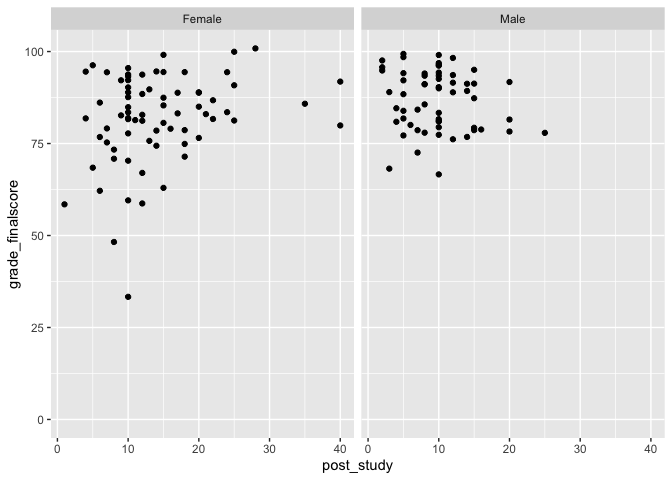
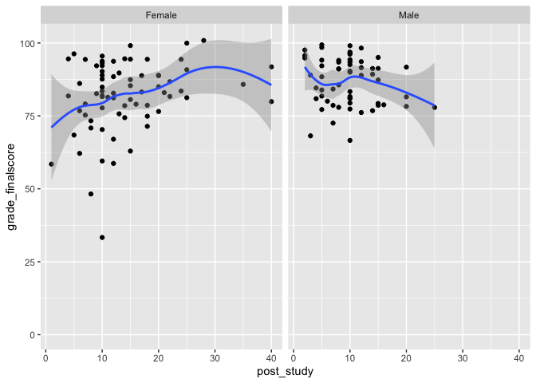
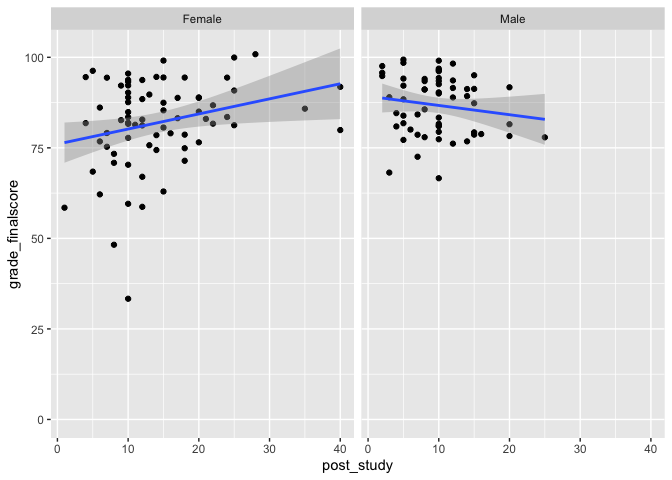

Lesson\_5
================
Fernando Rodriguez
2/7/2019

To-Do<br> 1. Create lesson 5 R-Markdown<br> 2.load readr, ggplot2,
summarytools, and dplyr libraries <br> 3. load physics demographic
data<br> 4. Save survey and gradebook data to your current data
folder<br>

# 0a. Load Libraries

``` r
library(readr)
library(ggplot2)
library(summarytools)
library(dplyr)
```

    ## 
    ## Attaching package: 'dplyr'

    ## The following objects are masked from 'package:stats':
    ## 
    ##     filter, lag

    ## The following objects are masked from 'package:base':
    ## 
    ##     intersect, setdiff, setequal, union

# 0b. Load our physics demographic data

# importing demographic data using read\_csv()

``` r
demog <- read_csv("/Volumes/GoogleDrive/My Drive/Intro to R Workshop - Winter 2019/Data Files/Physics Course Demo Data.csv")
```

    ## Parsed with column specification:
    ## cols(
    ##   roster_randomid = col_double(),
    ##   officialroster = col_character(),
    ##   ingradebookdata = col_character(),
    ##   insurveyparticipatedata = col_character(),
    ##   status = col_character(),
    ##   gender = col_character(),
    ##   eth2009rollupforreporting = col_character(),
    ##   agegroup = col_character(),
    ##   lowincomeflag = col_character(),
    ##   fulltimestatus = col_character(),
    ##   firstgenerationflag = col_character(),
    ##   homeprimarylang = col_character(),
    ##   admissionsstatusdetail = col_character(),
    ##   hsgpa = col_double(),
    ##   transfergpa = col_double(),
    ##   firstregacadyr = col_character(),
    ##   firstregacadterm = col_character(),
    ##   major1 = col_character()
    ## )

# 0c. Load the survey and gradebook data

``` r
survey <- read_csv("/Volumes/GoogleDrive/My Drive/Intro to R Workshop - Winter 2019/Data Files/Physics Course SV and GB Data.csv")
```

    ## Parsed with column specification:
    ## cols(
    ##   .default = col_double(),
    ##   post_ts = col_character(),
    ##   grade_lettergrade = col_character()
    ## )

    ## See spec(...) for full column specifications.

# Selecting columns with select()

``` r
ss <- select(survey, roster_randomid, post_ts)
```

1.  Find 4 choice variables from the demog dataframe that you want to
    work with.

2.  Use the select() function to subset the data put the 4 variable in
    this dataframe

3.  Include roster\_randomid variable

<!-- end list -->

``` r
vars <- select(demog, roster_randomid, status, gender, agegroup, hsgpa)
```

``` r
gender_ss <- filter(demog, gender == "Male" | gender == 
                      "Female")
```

# Merge Data

merge()

``` r
merged <- merge(demog, survey, by = "roster_randomid", all = TRUE)
```

``` r
merged2 <- merge(gender_ss, survey, by = "roster_randomid", all = FALSE)
```

# Data Exploration

1.  Merge your demog subsetted dataframe with the survey dataframe

2.  Start exploring relationships with the demog variable and the survey
    and/or gradebook variables

table(), summarize(), dfSummary(), ggplot(), plot() to explore potential
group differences or correlations

\` \#\#\#\# Subsetting by male and female
only

``` r
demog_ss_gender <- filter(demog, gender == "Male" | gender == "Female")
```

#### Merging the demog\_ss\_gender subsetted data with the new survey (survey and gradebook) data

``` r
merged_ss_gender <- merge(demog_ss_gender, survey, by = "roster_randomid", all = FALSE)
```

#### Plotting differences between males/females on

post\_study and
grade\_finalscore

``` r
ggplot(merged_ss_gender, aes(x = post_study, y = grade_finalscore)) + geom_point() + facet_grid(.~ gender)
```

    ## Warning: Removed 27 rows containing missing values (geom_point).

<!-- -->

#### Adding model line with standard errors

``` r
ggplot(merged_ss_gender, aes(x = post_study, y = grade_finalscore)) + geom_point() + facet_grid(.~ gender) + geom_smooth()
```

    ## `geom_smooth()` using method = 'loess' and formula 'y ~ x'

    ## Warning: Removed 27 rows containing non-finite values (stat_smooth).

    ## Warning: Removed 27 rows containing missing values (geom_point).

<!-- -->

#### Adding regression line

``` r
ggplot(merged_ss_gender, aes(x = post_study, y = grade_finalscore)) + geom_point() + facet_grid(.~ gender) + geom_smooth(method = "lm")
```

    ## Warning: Removed 27 rows containing non-finite values (stat_smooth).

    ## Warning: Removed 27 rows containing missing values (geom_point).

<!-- -->
