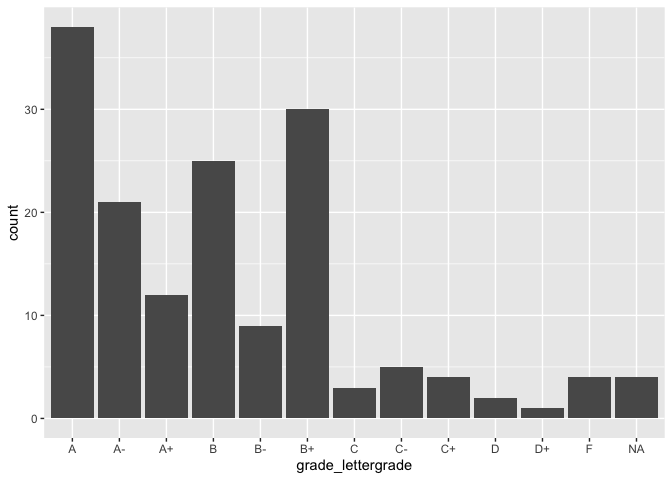

Lesson\_6
================
Fernando Rodriguez, Ying Xu, Ha Nguyen
2/14/2019

TO-DO Prior to Lesson<br> 1. Create lesson 6 R-Markdown<br> 2. load
readr, ggplot2, summarytools, and dplyr libraries <br> 3. load merged
data<br>

## 0a. Load Libraries

``` r
library(readr)
library(ggplot2)
library(summarytools)
library(dplyr)
```

    ## 
    ## Attaching package: 'dplyr'

    ## The following objects are masked from 'package:stats':
    ## 
    ##     filter, lag

    ## The following objects are masked from 'package:base':
    ## 
    ##     intersect, setdiff, setequal, union

``` r
library(cowplot)
```

    ## 
    ## Attaching package: 'cowplot'

    ## The following object is masked from 'package:ggplot2':
    ## 
    ##     ggsave

## 0b. Load our physics demographic data

importing demographic data using
read\_csv()

``` r
fulldata <- read_csv("/Volumes/GoogleDrive/My Drive/R Workspace/R-for-Ed-Data-Science/Data/Physics Course GB SV DEMO data.csv")
```

    ## Parsed with column specification:
    ## cols(
    ##   .default = col_double(),
    ##   officialroster = col_character(),
    ##   ingradebookdata = col_character(),
    ##   insurveyparticipatedata = col_character(),
    ##   status = col_character(),
    ##   gender = col_character(),
    ##   eth2009rollupforreporting = col_character(),
    ##   agegroup = col_character(),
    ##   lowincomeflag = col_character(),
    ##   fulltimestatus = col_character(),
    ##   firstgenerationflag = col_character(),
    ##   homeprimarylang = col_character(),
    ##   admissionsstatusdetail = col_character(),
    ##   firstregacadyr = col_character(),
    ##   firstregacadterm = col_character(),
    ##   major1 = col_character(),
    ##   post_ts = col_character(),
    ##   grade_lettergrade = col_character()
    ## )

    ## See spec(...) for full column specifications.

# 1\. Scatterplot using geom\_point()

## 1a. Basic scatterplot

``` r
theme_set(theme_grey())
ggplot(fulldata, aes(x = post_study, y = grade_finalscore)) + geom_point() 
```

    ## Warning: Removed 27 rows containing missing values (geom_point).

<!-- -->

## 1b. Scatterplot by group (gender)

``` r
ggplot(fulldata, aes(x = post_study, y = grade_finalscore)) + geom_point() + facet_grid(.~ gender)
```

    ## Warning: Removed 27 rows containing missing values (geom_point).

<!-- -->

## 1c. Change color and point size

Single color and
size

``` r
ggplot(fulldata, aes(x = post_study, y = grade_finalscore)) + geom_point(color = "red", size = 1.5) + facet_grid(.~ gender)
```

    ## Warning: Removed 27 rows containing missing values (geom_point).

<!-- -->

Color based on variable
value

``` r
ggplot(fulldata, aes(x = post_study, y = grade_finalscore, color = fulltimestatus)) + geom_point(size = 1.5) + facet_grid(.~ gender)
```

    ## Warning: Removed 27 rows containing missing values (geom_point).

<!-- -->

## 1d. Save plot as an object

``` r
sctplot <- ggplot(fulldata, aes(x = post_study, y = grade_finalscore, color = fulltimestatus)) + geom_point(size = 1.5) + facet_grid(.~ gender)
sctplot
```

    ## Warning: Removed 27 rows containing missing values (geom_point).

<!-- -->

## 1e. Add (change) label and caption

``` r
sctplot_label <- sctplot  + labs(x = "Weekly study time", y = "Final score", caption = "Source: UCI Physics course data.", colour = "Full time status") 
sctplot_label
```

    ## Warning: Removed 27 rows containing missing values (geom_point).

<!-- -->

## 1f. Add title

``` r
sctplot_title <- sctplot_label + ggtitle("Association between Reported Study Time and Final Grade") 
sctplot_title
```

    ## Warning: Removed 27 rows containing missing values (geom_point).

<!-- -->

## 1g. Use predefined themes

``` r
sctplot_theme <- sctplot_title + theme_light()
sctplot_theme
```

    ## Warning: Removed 27 rows containing missing values (geom_point).

<!-- -->

``` r
## Also try theme_dark() and theme_minimal()
```

## 1h. Add a regression line

``` r
sctplot_final <- sctplot_theme + geom_smooth(method = "lm")
sctplot_final
```

    ## Warning: Removed 27 rows containing non-finite values (stat_smooth).

    ## Warning: Removed 27 rows containing missing values (geom_point).

<!-- -->

# 2\. Bar chart using geom\_bar()

## 2a. Basic bar chart

``` r
ggplot(fulldata, aes(x = grade_lettergrade)) + geom_bar()
```

<!-- -->

## 2b. Remove missing value from the chart

``` r
fulldata_ss <- filter(fulldata, !is.na(fulldata$grade_lettergrade))
```

## 2c. Plot the bar graph with the subsetted data again

``` r
ggplot(fulldata_ss, aes(x = grade_lettergrade)) + geom_bar()
```

<!-- -->

## 2d. Fill the bar graphs by another variables

``` r
barplot_color <- ggplot(fulldata_ss, aes(x = grade_lettergrade, 
                                         fill = fulltimestatus)) + geom_bar()
barplot_color
```

<!-- -->

## 2e. Add title, labels, and captions.

``` r
barplot_title <- barplot_color + labs(x = "Grade", y = "Count", 
                                      fill = "Full time status", caption = "Source: UCI Physic course data") + ggtitle("Letter Grade Distribution by Full/Part Time Status ")
barplot_title
```

<!-- -->

## 2f. Change theme

``` r
barplot_theme <- barplot_title + theme_light()
barplot_theme
```

<!-- -->

## 2g. Remove the gridline in barcharts

``` r
barplot_final <- barplot_theme + background_grid(major = "none")
barplot_final
```

<!-- -->

# 3\. Putting graphs into one grid and changing gridline using the package “cowplot”

<https://cran.r-project.org/web/packages/cowplot/vignettes/introduction.html>

## 3a. Load cowplot package

``` r
library(cowplot)
```

## 3b. Putting two graphs in one plot

``` r
sct_bar_plot <- plot_grid(sctplot_final, barplot_final, labels =  c("A", "B"), nrow = 2)
```

    ## Warning: Removed 27 rows containing non-finite values (stat_smooth).

    ## Warning: Removed 27 rows containing missing values (geom_point).

``` r
sct_bar_plot
```

<!-- -->

# 4\. Save plot as png file

``` r
save_plot("cowplot.png", sct_bar_plot, base_aspect_ratio = 1.4)
```
