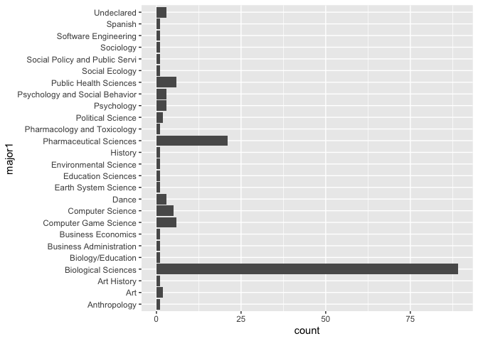
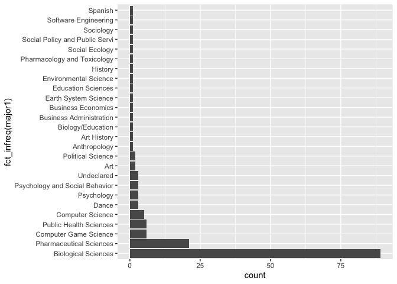
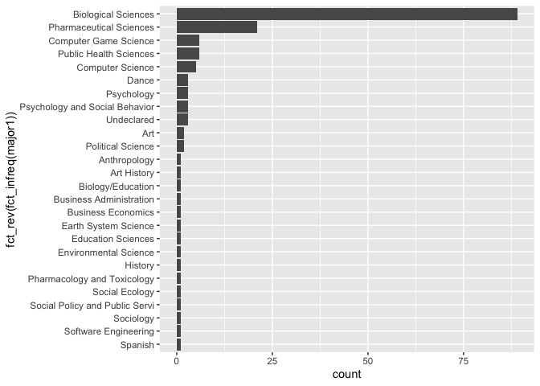
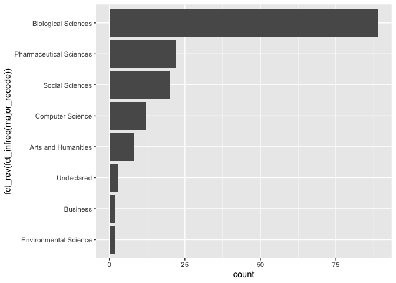

Lessson\_7
================
Fernando Rodriguez
2/21/2019

1.  Create lesson 7 R-Markdown<br>
2.  Install following packages<br>
      - install.packages(“rforcats”)<br>
      - install.packages(“kableExtra”)<br>
      - install.packages(“psych”)<br>
3.  Load libraries below<br>
4.  Load ‘Physics Course GB SV DEMO data.csv’ as ‘fulldata’<br>

# 0a. Load Libraries

``` r
library(readr) # for reading in data
library(ggplot2) # for plotting
library(summarytools) # for summarizing data
library(dplyr) # for selecting and filtering
```

    ## 
    ## Attaching package: 'dplyr'

    ## The following objects are masked from 'package:stats':
    ## 
    ##     filter, lag

    ## The following objects are masked from 'package:base':
    ## 
    ##     intersect, setdiff, setequal, union

``` r
library(forcats) # for working with categorical variables
library(kableExtra) # for making tables
library(psych) # for doing descriptives and analyses
```

    ## 
    ## Attaching package: 'psych'

    ## The following objects are masked from 'package:ggplot2':
    ## 
    ##     %+%, alpha

# 0b. Load data

``` r
fulldata <- read_csv("/Volumes/GoogleDrive/My Drive/Intro to R Workshop - Winter 2019/Data Files/Physics Course GB SV DEMO data.csv")
```

    ## Parsed with column specification:
    ## cols(
    ##   .default = col_double(),
    ##   officialroster = col_character(),
    ##   ingradebookdata = col_character(),
    ##   insurveyparticipatedata = col_character(),
    ##   status = col_character(),
    ##   gender = col_character(),
    ##   eth2009rollupforreporting = col_character(),
    ##   agegroup = col_character(),
    ##   lowincomeflag = col_character(),
    ##   fulltimestatus = col_character(),
    ##   firstgenerationflag = col_character(),
    ##   homeprimarylang = col_character(),
    ##   admissionsstatusdetail = col_character(),
    ##   firstregacadyr = col_character(),
    ##   firstregacadterm = col_character(),
    ##   major1 = col_character(),
    ##   post_ts = col_character(),
    ##   grade_lettergrade = col_character()
    ## )

    ## See spec(...) for full column specifications.

# 1\. Working with Factors/Characters/Strings

``` r
ggplot(fulldata, aes(x = major1)) + geom_bar() + coord_flip()
```

<!-- -->

# Using forcats() library to change the order

``` r
str(fulldata)
```

    ## Classes 'spec_tbl_df', 'tbl_df', 'tbl' and 'data.frame': 158 obs. of  41 variables:
    ##  $ roster_randomid          : num  104500 104716 105751 106707 130996 ...
    ##  $ officialroster           : chr  "Yes" "Yes" "Yes" "Yes" ...
    ##  $ ingradebookdata          : chr  "Yes" "Yes" "Yes" "Yes" ...
    ##  $ insurveyparticipatedata  : chr  "Yes" "Yes" "Yes" "Yes" ...
    ##  $ status                   : chr  "Enrolled" "Enrolled" "Enrolled" "Enrolled" ...
    ##  $ gender                   : chr  "Male" "Male" "Female" "Female" ...
    ##  $ eth2009rollupforreporting: chr  "Hispanic" "Asian / Pacific Islander" "Asian / Pacific Islander" "Asian / Pacific Islander" ...
    ##  $ agegroup                 : chr  "19" "19" "19" "23" ...
    ##  $ lowincomeflag            : chr  "Y" "N" "Y" "Y" ...
    ##  $ fulltimestatus           : chr  "Full-time" "Part-time" "Part-time" "Part-time" ...
    ##  $ firstgenerationflag      : chr  "N" "N" "Y" "Y" ...
    ##  $ homeprimarylang          : chr  "English/non-English" "English only" "English/non-English" "English/non-English" ...
    ##  $ admissionsstatusdetail   : chr  "Freshman" "Freshman" "Freshman" "Transfer" ...
    ##  $ hsgpa                    : num  4 4.07 3.95 NA NA ...
    ##  $ transfergpa              : num  NA NA NA 3.28 3.14 ...
    ##  $ firstregacadyr           : chr  "2014-15" "2014-15" "2014-15" "2014-15" ...
    ##  $ firstregacadterm         : chr  "Fall" "Fall" "Fall" "Fall" ...
    ##  $ major1                   : chr  "Biological Sciences" "Pharmaceutical Sciences" "Biological Sciences" "Public Health Sciences" ...
    ##  $ post_ts                  : chr  "7/25/16 19:47" "7/22/16 23:31" "7/25/16 21:33" "7/22/16 18:18" ...
    ##  $ post_study               : num  3 8 17 10 15 7 10 8 15 18 ...
    ##  $ post_er1                 : num  2 2 2 3 3 3 2 2 1 3 ...
    ##  $ post_er2                 : num  4 3 3 3 3 3 4 2 5 5 ...
    ##  $ post_er3                 : num  2 3 2 3 3 3 2 1 3 1 ...
    ##  $ post_er4                 : num  4 3 3 3 3 3 4 4 3 4 ...
    ##  $ post_activ1              : num  1 1 2 2 3 4 3 2 4 6 ...
    ##  $ post_activ2              : num  2 0 0 4 2 0 0 0 0 0 ...
    ##  $ post_activ3              : num  0 0 0 NA 2 0 0 0 0 0 ...
    ##  $ post_activ4              : num  1 0 0 3 1 0 0 NA 1 0 ...
    ##  $ post_activ5              : num  2 7 1 1 1 2 5 7 4 2 ...
    ##  $ post_activ6              : num  0 0 0 1 1 0 0 0 0 0 ...
    ##  $ post_activ7              : num  0 1 1 2 3 3 0 0 1 0 ...
    ##  $ post_aca1                : num  2 1 1 2 1 2 1 1 2 2 ...
    ##  $ post_aca2                : num  1 1 1 1 1 1 1 1 2 1 ...
    ##  $ post_aca3                : num  1 2 1 1 1 1 3 1 1 1 ...
    ##  $ post_aca4                : num  1 3 1 1 1 2 4 1 2 1 ...
    ##  $ post_aca5                : num  1 1 1 NA 1 1 1 1 2 1 ...
    ##  $ quizzes                  : num  90.4 82.2 92.9 0 85.8 ...
    ##  $ homework                 : num  105 103 103 NA 93 104 104 99 99 94 ...
    ##  $ finalexam                : num  82 61 80 NA 64 87 98 90 84 45 ...
    ##  $ grade_finalscore         : num  89 77.9 88.8 33.3 79.3 ...
    ##  $ grade_lettergrade        : chr  "A-" "B" "A-" "F" ...
    ##  - attr(*, "spec")=
    ##   .. cols(
    ##   ..   roster_randomid = col_double(),
    ##   ..   officialroster = col_character(),
    ##   ..   ingradebookdata = col_character(),
    ##   ..   insurveyparticipatedata = col_character(),
    ##   ..   status = col_character(),
    ##   ..   gender = col_character(),
    ##   ..   eth2009rollupforreporting = col_character(),
    ##   ..   agegroup = col_character(),
    ##   ..   lowincomeflag = col_character(),
    ##   ..   fulltimestatus = col_character(),
    ##   ..   firstgenerationflag = col_character(),
    ##   ..   homeprimarylang = col_character(),
    ##   ..   admissionsstatusdetail = col_character(),
    ##   ..   hsgpa = col_double(),
    ##   ..   transfergpa = col_double(),
    ##   ..   firstregacadyr = col_character(),
    ##   ..   firstregacadterm = col_character(),
    ##   ..   major1 = col_character(),
    ##   ..   post_ts = col_character(),
    ##   ..   post_study = col_double(),
    ##   ..   post_er1 = col_double(),
    ##   ..   post_er2 = col_double(),
    ##   ..   post_er3 = col_double(),
    ##   ..   post_er4 = col_double(),
    ##   ..   post_activ1 = col_double(),
    ##   ..   post_activ2 = col_double(),
    ##   ..   post_activ3 = col_double(),
    ##   ..   post_activ4 = col_double(),
    ##   ..   post_activ5 = col_double(),
    ##   ..   post_activ6 = col_double(),
    ##   ..   post_activ7 = col_double(),
    ##   ..   post_aca1 = col_double(),
    ##   ..   post_aca2 = col_double(),
    ##   ..   post_aca3 = col_double(),
    ##   ..   post_aca4 = col_double(),
    ##   ..   post_aca5 = col_double(),
    ##   ..   quizzes = col_double(),
    ##   ..   homework = col_double(),
    ##   ..   finalexam = col_double(),
    ##   ..   grade_finalscore = col_double(),
    ##   ..   grade_lettergrade = col_character()
    ##   .. )

Let’s work with the major1 variable

We see that our import assigned this variable as a character. We want to
change this into a factor.

When we use summary() \[BaseR\],

``` r
summary(fulldata$major1)
```

    ##    Length     Class      Mode 
    ##       158 character character

Changing structure type to factor using as.factor() you can also use
factor()

``` r
fulldata$major1 <- as.factor(fulldata$major1)
```

``` r
summary(fulldata$major1)
```

    ##                   Anthropology                            Art 
    ##                              1                              2 
    ##                    Art History            Biological Sciences 
    ##                              1                             89 
    ##              Biology/Education        Business Administration 
    ##                              1                              1 
    ##             Business Economics          Computer Game Science 
    ##                              1                              6 
    ##               Computer Science                          Dance 
    ##                              5                              3 
    ##           Earth System Science             Education Sciences 
    ##                              1                              1 
    ##          Environmental Science                        History 
    ##                              1                              1 
    ##        Pharmaceutical Sciences    Pharmacology and Toxicology 
    ##                             21                              1 
    ##              Political Science                     Psychology 
    ##                              2                              3 
    ## Psychology and Social Behavior         Public Health Sciences 
    ##                              3                              6 
    ##                 Social Ecology Social Policy and Public Servi 
    ##                              1                              1 
    ##                      Sociology           Software Engineering 
    ##                              1                              1 
    ##                        Spanish                     Undeclared 
    ##                              1                              3

## Using fct\_count() function

``` r
fct_count(fulldata$major1)
```

    ## # A tibble: 26 x 2
    ##    f                           n
    ##    <fct>                   <int>
    ##  1 Anthropology                1
    ##  2 Art                         2
    ##  3 Art History                 1
    ##  4 Biological Sciences        89
    ##  5 Biology/Education           1
    ##  6 Business Administration     1
    ##  7 Business Economics          1
    ##  8 Computer Game Science       6
    ##  9 Computer Science            5
    ## 10 Dance                       3
    ## # … with 16 more rows

## using fct\_infreq()

``` r
tableexample1 <- fct_count(fct_infreq(fulldata$major1))
```

## using fct\_infreq() in ggplot

``` r
ggplot(fulldata, aes(x = fct_infreq(major1))) + geom_bar() + coord_flip()
```

<!-- -->

## use the fct\_rev() function to reverse the order

``` r
ggplot(fulldata, aes(x = fct_rev(fct_infreq(major1)))) + geom_bar() + coord_flip()
```

<!-- -->

``` r
fulldata$major_recode <- as.character(fulldata$major1)
fct_count(fct_infreq(fulldata$major_recode))
```

    ## # A tibble: 26 x 2
    ##    f                                  n
    ##    <fct>                          <int>
    ##  1 Biological Sciences               89
    ##  2 Pharmaceutical Sciences           21
    ##  3 Computer Game Science              6
    ##  4 Public Health Sciences             6
    ##  5 Computer Science                   5
    ##  6 Dance                              3
    ##  7 Psychology                         3
    ##  8 Psychology and Social Behavior     3
    ##  9 Undeclared                         3
    ## 10 Art                                2
    ## # … with 16 more rows

# 2/22/19 Fixing Recoding Issue

# Initialize the fulldata$major\_recode variable

``` r
fulldata$major_recode <- as.character(fulldata$major1)
```

``` r
# Pharmaceutical Sciences
fulldata$major_recode[fulldata$major1 == "Pharmacology and Toxicology"] <- "Pharmaceutical Sciences"

# cs
fulldata$major_recode[fulldata$major1 == "Computer Science"] <- "Computer Science"
fulldata$major_recode[fulldata$major1 == "Computer Game Science"] <- "Computer Science"
fulldata$major_recode[fulldata$major1 == "Software Engineering"] <- "Computer Science"

# arts and humanities
fulldata$major_recode[fulldata$major1 == "Dance"] <- "Arts and Humanities"
fulldata$major_recode[fulldata$major1 == "Art"] <- "Arts and Humanities"
fulldata$major_recode[fulldata$major1 == "Art History"] <- "Arts and Humanities"
fulldata$major_recode[fulldata$major1 == "History"] <- "Arts and Humanities"
fulldata$major_recode[fulldata$major1 == "Spanish"] <- "Arts and Humanities"


# social sciences
fulldata$major_recode[fulldata$major1 == "Public Health Sciences"] <- "Social Sciences"
fulldata$major_recode[fulldata$major1 == "Psychology"] <- "Social Sciences"
fulldata$major_recode[fulldata$major1 == "Psychology and Social Behavior"] <- "Social Sciences"
fulldata$major_recode[fulldata$major1 == "Sociology"] <- "Social Sciences"
fulldata$major_recode[fulldata$major1 == "Political Science"] <- "Social Sciences"
fulldata$major_recode[fulldata$major1 == "Anthropology"] <- "Social Sciences"
fulldata$major_recode[fulldata$major1 == "Biology/Education"] <- "Social Sciences"
fulldata$major_recode[fulldata$major1 == "Education Sciences"] <- "Social Sciences"
fulldata$major_recode[fulldata$major1 == "Social Ecology"] <- "Social Sciences"
fulldata$major_recode[fulldata$major1 == "Social Policy and Public Servi"] <- "Social Sciences"

# Business
fulldata$major_recode[fulldata$major1 == "Business Administration"] <- "Business"
fulldata$major_recode[fulldata$major1 == "Business Economics"] <- "Business"

# enviromental sciences
fulldata$major_recode[fulldata$major1 == "Earth System Science"] <- "Environmental Science"
fulldata$major_recode[fulldata$major1 == "Environmental Science"] <- "Environmental Science"
```

## Same plot, but with the recoded major varialbe, major\_recode

``` r
ggplot(fulldata, aes(x = fct_rev(fct_infreq(major_recode)))) + geom_bar() + coord_flip()
```

<!-- -->

## Use kableExtra to make nice looking tables

### also using psych package to provide the summary statistics

kable() function give us a nice clean table

``` r
kable(tableexample1)
```

<table>

<thead>

<tr>

<th style="text-align:left;">

f

</th>

<th style="text-align:right;">

n

</th>

</tr>

</thead>

<tbody>

<tr>

<td style="text-align:left;">

Biological Sciences

</td>

<td style="text-align:right;">

89

</td>

</tr>

<tr>

<td style="text-align:left;">

Pharmaceutical Sciences

</td>

<td style="text-align:right;">

21

</td>

</tr>

<tr>

<td style="text-align:left;">

Computer Game Science

</td>

<td style="text-align:right;">

6

</td>

</tr>

<tr>

<td style="text-align:left;">

Public Health Sciences

</td>

<td style="text-align:right;">

6

</td>

</tr>

<tr>

<td style="text-align:left;">

Computer Science

</td>

<td style="text-align:right;">

5

</td>

</tr>

<tr>

<td style="text-align:left;">

Dance

</td>

<td style="text-align:right;">

3

</td>

</tr>

<tr>

<td style="text-align:left;">

Psychology

</td>

<td style="text-align:right;">

3

</td>

</tr>

<tr>

<td style="text-align:left;">

Psychology and Social Behavior

</td>

<td style="text-align:right;">

3

</td>

</tr>

<tr>

<td style="text-align:left;">

Undeclared

</td>

<td style="text-align:right;">

3

</td>

</tr>

<tr>

<td style="text-align:left;">

Art

</td>

<td style="text-align:right;">

2

</td>

</tr>

<tr>

<td style="text-align:left;">

Political Science

</td>

<td style="text-align:right;">

2

</td>

</tr>

<tr>

<td style="text-align:left;">

Anthropology

</td>

<td style="text-align:right;">

1

</td>

</tr>

<tr>

<td style="text-align:left;">

Art History

</td>

<td style="text-align:right;">

1

</td>

</tr>

<tr>

<td style="text-align:left;">

Biology/Education

</td>

<td style="text-align:right;">

1

</td>

</tr>

<tr>

<td style="text-align:left;">

Business Administration

</td>

<td style="text-align:right;">

1

</td>

</tr>

<tr>

<td style="text-align:left;">

Business Economics

</td>

<td style="text-align:right;">

1

</td>

</tr>

<tr>

<td style="text-align:left;">

Earth System Science

</td>

<td style="text-align:right;">

1

</td>

</tr>

<tr>

<td style="text-align:left;">

Education Sciences

</td>

<td style="text-align:right;">

1

</td>

</tr>

<tr>

<td style="text-align:left;">

Environmental Science

</td>

<td style="text-align:right;">

1

</td>

</tr>

<tr>

<td style="text-align:left;">

History

</td>

<td style="text-align:right;">

1

</td>

</tr>

<tr>

<td style="text-align:left;">

Pharmacology and Toxicology

</td>

<td style="text-align:right;">

1

</td>

</tr>

<tr>

<td style="text-align:left;">

Social Ecology

</td>

<td style="text-align:right;">

1

</td>

</tr>

<tr>

<td style="text-align:left;">

Social Policy and Public Servi

</td>

<td style="text-align:right;">

1

</td>

</tr>

<tr>

<td style="text-align:left;">

Sociology

</td>

<td style="text-align:right;">

1

</td>

</tr>

<tr>

<td style="text-align:left;">

Software
Engineering

</td>

<td style="text-align:right;">

1

</td>

</tr>

<tr>

<td style="text-align:left;">

Spanish

</td>

<td style="text-align:right;">

1

</td>

</tr>

</tbody>

</table>

## We can examine grade describes and create a table using kableExtra library

First, I need to subset the variables I want to look at. Here I am
looking at the gradebook
data

``` r
data_ss1 <- select(fulldata, quizzes, homework, finalexam, grade_finalscore)
```

Second, I want to use the data\_ss1 subset to get descriptives We are
going to use the describe() function from the psych library

``` r
tableexample2 <- describe(data_ss1)
tableexample2
```

    ##                  vars   n  mean    sd median trimmed   mad min    max
    ## quizzes             1 153 81.95 16.92  85.80   84.53 10.67   0 100.00
    ## homework            2 152 94.22 16.23  99.00   97.72  7.41  11 107.00
    ## finalexam           3 152 75.95 19.31  79.50   77.74 18.53   0 106.00
    ## grade_finalscore    4 154 81.89 14.50  83.41   84.07 10.87   0 100.85
    ##                   range  skew kurtosis   se
    ## quizzes          100.00 -1.95     5.06 1.37
    ## homework          96.00 -3.08    10.82 1.32
    ## finalexam        106.00 -1.02     1.35 1.57
    ## grade_finalscore 100.85 -2.20     7.50 1.17

## Using the kable\_styling() function and bootstrap\_options arguments within kableExtra..

  - striped
  - hover
  - bordered
  - condensed
  - full\_width

<!-- end list -->

``` r
# kable(tableexample2) %>% # this is a pipe, it just tells r "then do this"
#  kable_styling(bootstrap_options = c("striped"))
```

``` r
# kable(tableexample2) %>% # this is a pipe, it just tells r "then do this"
#  kable_styling(bootstrap_options = c("striped", "hover"))
```

``` r
# kable(tableexample2) %>% # this is a pipe, it just tells r "then do this"
#  kable_styling(bootstrap_options = c("striped", "hover", "bordered"))
```

``` r
# kable(tableexample2) %>% # this is a pipe, it just tells r "then do this"
#  kable_styling(bootstrap_options = c("striped", "hover", "bordered", "condensed"))
```

``` r
# kable(tableexample2) %>% # this is a pipe, it just tells r "then do this"
#  kable_styling(bootstrap_options = c("striped", "hover", "bordered", "condensed"), 
#                full_width = FALSE)
```
