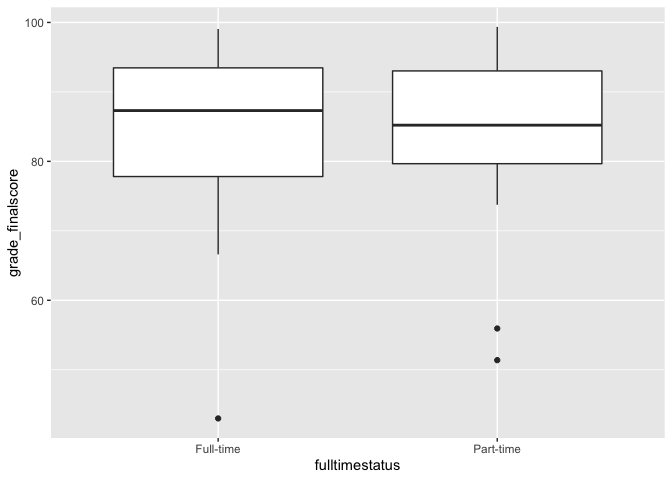

Lessson\_7
================
Fernando Rodriguez
2/21/2019

To-Do<br> 1. Create lesson 8 R-Markdown<br> 2. Load libraries below<br>
3. Load ‘Physics Course GB SV DEMO data.csv’ as ‘fulldata’<br>

# 0a. Load Libraries

``` r
library(readr) # for reading in data
library(ggplot2) # for plotting
library(dplyr) # for selecting and filtering
```

    ## 
    ## Attaching package: 'dplyr'

    ## The following objects are masked from 'package:stats':
    ## 
    ##     filter, lag

    ## The following objects are masked from 'package:base':
    ## 
    ##     intersect, setdiff, setequal, union

# 0b. Load data

``` r
fulldata <- read_csv("/Volumes/GoogleDrive/My Drive/Intro to R Workshop - Winter 2019/Data Files/Physics Course GB SV DEMO CLICK Data.csv")
```

    ## Parsed with column specification:
    ## cols(
    ##   .default = col_double(),
    ##   officialroster = col_character(),
    ##   ingradebookdata = col_character(),
    ##   insurveyparticipatedata = col_character(),
    ##   status = col_character(),
    ##   gender = col_character(),
    ##   eth2009rollupforreporting = col_character(),
    ##   agegroup = col_character(),
    ##   lowincomeflag = col_character(),
    ##   fulltimestatus = col_character(),
    ##   firstgenerationflag = col_character(),
    ##   homeprimarylang = col_character(),
    ##   admissionsstatusdetail = col_character(),
    ##   firstregacadyr = col_character(),
    ##   firstregacadterm = col_character(),
    ##   major1 = col_character(),
    ##   post_ts = col_character(),
    ##   grade_lettergrade = col_character()
    ## )

    ## See spec(...) for full column specifications.

# 1\. Vectors

a basic data structure containing elements of the same type. Vectors are
one dimensional arrays.

## Using Vectors

We have focused on the tidyverse way to select and subset our rows and
columns.

However the baseR way of doing this uses, what we call vectors.

Two types of vectors Atomic vectors: logical, integer, double (double
precision floating point numbers, character, complex, and raw atomic
vectors are homogeonous (they are the same type)

Lists (sometimes called recursive vectors) because lists can contain
other lists Lists are heterogenous (can be different atomic vectors)

We cam make a list using the baseR list() function

``` r
list1 <- list(1, 4, 6, 7, 8, 9)
```

## NULL

NULL is used to represent absence of a vector and is often treated as a
lenghth 0 vector

## Vector Properties

Vectors have 2 key properties: 1) `type` nd 2) `length`

1.  `types` (what type of vector it is) We can see this by using
    typeof()

# the default storage for integers are the double type

``` r
typeof(353)
```

    ## [1] "double"

``` r
typeof(1)
```

    ## [1] "double"

``` r
typeof(1.3)
```

    ## [1] "double"

``` r
typeof(fulldata$tot_click)
```

    ## [1] "double"

``` r
typeof(fulldata$gender)
```

    ## [1] "character"

``` r
typeof(list1)
```

    ## [1] "list"

2.  `length` How long a vector is

<!-- end list -->

``` r
length(fulldata$tot_click)
```

    ## [1] 152

We see that the length of each numeric value is the independent values
in a vector or list

``` r
length(1.3)
```

    ## [1] 1

``` r
length(list1)
```

    ## [1] 6

Remember that lists can be combinations of numeric and string character
values

``` r
list2 <- list(2, "hello", 2.2)

length(list2)
```

    ## [1] 3

``` r
length(fulldata$tot_click)
```

    ## [1] 152

# Character Vectors

For characters, the length is 1 for every enclosed unit ""

``` r
char1 <- ("hello how are you")
typeof(char1)
```

    ## [1] "character"

``` r
length(char1)
```

    ## [1] 1

This is the same for vectors of characters

``` r
typeof(fulldata$gender)
```

    ## [1] "character"

``` r
length(fulldata$gender)
```

    ## [1] 152

# Naming Vectors

You can actually name vectors

``` r
list3 <- c(x = 1, y = 2)

list3
```

    ## x y 
    ## 1 2

# Subsetting vectors

We used the filter() function in dplyr (deeplyer)

\[ is the subsetting function,

and is use like this x\[a\]

There are 4 types of things you can subset vectors with

First, lets create a vector of strings c() is a funciton that returns a
vector (a one dimensional array)

``` r
x <- c("one", "two", "apple", "four")

typeof(x)
```

    ## [1] "character"

We can filter out specific characters in our vector x each character in
our vector x is indexed, starting at 1

``` r
x[c(1, 3)]
```

    ## [1] "one"   "apple"

you can repeat positions to make longer outputs as
    well

``` r
x[c(1, 3, 4, 1, 1, 2, 2, 2, 2)]
```

    ## [1] "one"   "apple" "four"  "one"   "one"   "two"   "two"   "two"   "two"

negative values drop the lements at the specified position

``` r
x[c(-1, -3)]
```

    ## [1] "two"  "four"

You cannot mix positive and negative subsetting values

``` r
# x[c(-1, 3)]
```

# Piping %\>%

%\>%

shortcut method for performing data filtering, selecting, etc.

%\>% basicially states ‘then do this’ try to follow the logic of how you
already work with data

``` r
fulldata %>%
  filter(gender == "Male") %>%
  ggplot(aes(x = fulltimestatus, y = grade_finalscore)) + geom_boxplot()
```

<!-- -->
